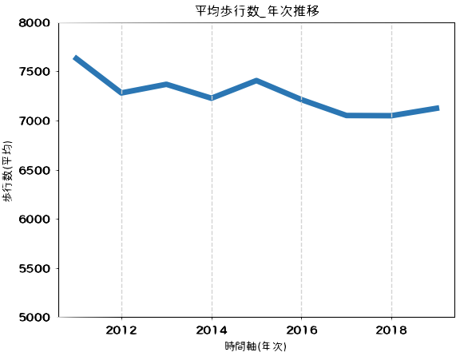
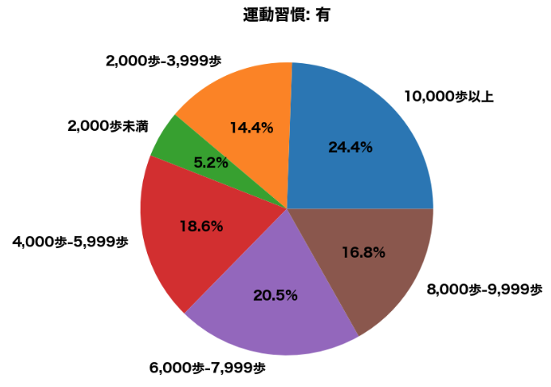
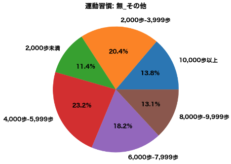
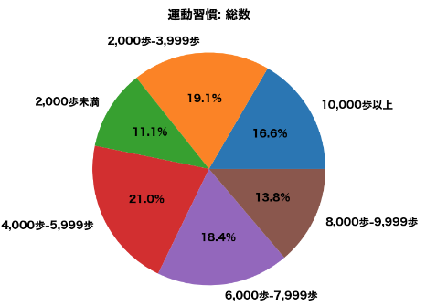
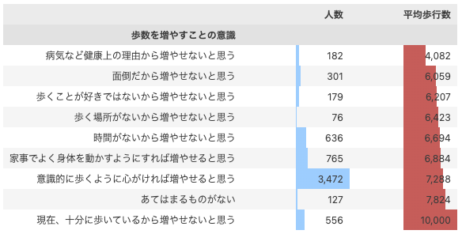

## 歩行数について

### 2009年から2017年の推移

- 2009年から2017年まで平均して毎年60歩ずつ減少している
- 目標の8000歩には平均からみると足りていない状況

### 運動習慣の状況別の歩行数について

#### 運動習慣あり

- 8000歩以上の割合：40.2%

#### 運動習慣なし_その他(健康上の理由を除く)

- 8000歩以上の割合：26.9%

#### 総数

- 8000歩以上の割合：30.4%
- 健康上の理由も含む

### 歩行を増やすことの意識と歩行数の関係

- 「十分に歩いているから増やせないと思う」のみ8000歩以上の結果
- その他は8000歩以下である結果
- 意識は大事ですが、、、習慣化にする必要があるのでは？

