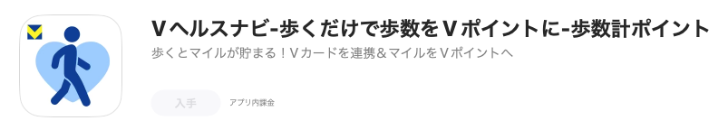
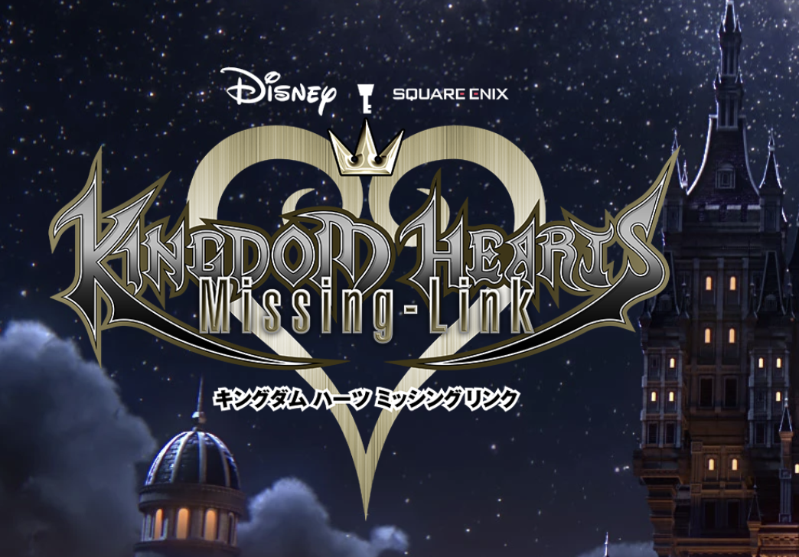

# 03_継続するために
## 報酬系
- 報酬系には意識系に関係する前頭葉、記憶に関係する海馬、感情に関係する扁桃体がかんけいします。
- 報酬系はドーパミンを分泌して、頭の回転をあげたり、気分を高揚させたりします。
- しかし、報酬系は簡単すぎる課題や難しすぎる課題は反応しないと研究報告がされています。
- 少し頑張れば課題をクリアできそうなときに報酬系が反応します。

- 報酬系を反応させるには外発的動機づけと内発的動機づけがあり、その動機づけによって報酬系が反応し行動に結びつきます。

- 外発的動機づけ：お金、地位、賞、ランキング
- 内発的動機づけ：ドキドキ感、ワクワク感、達成感

## 習慣化
- 意志の力を使う時は前頭葉に負荷がかかるため、疲れているときに意思力が低下します。
- 歯磨きや入浴はさほど意思力がなくても行動に移すことができます
- 歩行も同様で習慣化にすれば意識しなくても自然に歩く行動がみにつくと思います

## 位置情報系アプリ
- 位置情報系アプリは外発的動機づけにも内発的動機づけにもアプローチができます

#### [Vヘルスケア](https://apps.apple.com/jp/app/v%E3%83%98%E3%83%AB%E3%82%B9%E3%83%8A%E3%83%93-%E6%AD%A9%E3%81%8F%E3%81%A0%E3%81%91%E3%81%A7%E6%AD%A9%E6%95%B0%E3%82%92v%E3%83%9D%E3%82%A4%E3%83%B3%E3%83%88%E3%81%AB-%E6%AD%A9%E6%95%B0%E8%A8%88%E3%83%9D%E3%82%A4%E3%83%B3%E3%83%88/id1595530670)

#### [PokémonGO](https://www.pokemongo.jp/)

#### [ドラゴンクエストウォーク](https://www.dragonquest.jp/walk/)

#### [jリーグウォーキング](https://www.meijiyasuda.co.jp/brand/kenkatsu/walking/)

#### [位置情報・GPS対応おすすめアプリランキングTOP13](https://uta-macross.jp/mobile-gps-game/)
  - 1位 モンスターハンターNOW
  - 2位 ポケモンGO
  - 3位 信長の野望 出陣
  - 4位 ドラゴンクエストウォーク
  - 5位 Pikmin Bloom

#### [キングダムハーツミッシングリンク](https://www.jp.square-enix.com/kingdom/ml/)

